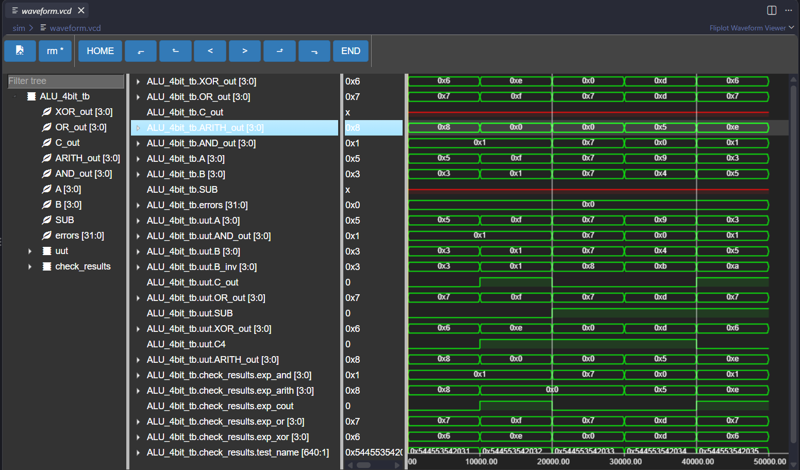

# 4-Bit Discrete Logic ALU (Arithmetic Logic Unit)


A hardware-level implementation and RTL verification of a **4-bit Arithmetic Logic Unit (ALU)** designed entirely using discrete **74HCxx series logic ICs** (74HC283, 74HC86, 74HC08, 74HC32) without integrated microcontrollers or FPGAs.

The project models the exact gate-level hardware architecture in **Proteus** and provides a cycle-accurate, self-checking simulation in **Verilog HDL** via **Icarus Verilog** and **GTKWave**.

---

## 📸 Circuit Schematic & Waveform Verification

### Hardware Gate-Level Schematic

*Figure 1: Full 4-bit ALU circuit schematic designed and simulated in Proteus.*

### RTL Simulation Waveform

*Figure 2: Verilog simulation waveform generated via Icarus Verilog and visualized using GTKWave.*

---

## 🚀 Key Features

### 1. Concurrent Parallel Computation
The arithmetic and logic blocks process the shared 4-bit input vectors `A[3:0]` and `B[3:0]` simultaneously without clock latency:
* **Arithmetic Operations:**
  * Addition: `A + B`
  * Subtraction (Two's complement): `A - B = A + (~B) + 1`
* **Bitwise Logic Operations:**
  * `A AND B` (IC 74HC08)
  * `A OR B` (IC 74HC32)
  * `A XOR B` (IC 74HC86)

### 2. Normalized Carry / Borrow Flag Conditioning
The raw carry-out (`C4`) of the binary adder (74HC283) behaves inversely during two's complement subtraction (`C4 = 1` when $A \ge B$, `C4 = 0` when $A < B$). A dedicated XOR conditioning gate standardizes this into an intuitive borrow/carry flag:

$$\text{Cout} = C_4 \oplus \text{SUB}$$

| Operation | SUB | Cout = 0 | Cout = 1 |
| :--- | :---: | :--- | :--- |
| **Addition** | `0` | No carry overflow | Carry-out occurred |
| **Subtraction** | `1` | No borrow ($A \ge B$, e.g., $1 - 1 = 0$) | Underflow / Borrow needed ($A < B$) |

---

## 💻 Verilog HDL Architecture

The hardware architecture is organized into dedicated directories:
* `rtl/ALU_4bit.v`: Structural Verilog model reflecting discrete IC wiring.
* `sim/ALU_4bit_tb.v`: Automated self-checking testbench.

```verilog
module ALU_4bit (
    input  wire [3:0] A,
    input  wire [3:0] B,
    input  wire       SUB,

    output wire [3:0] ARITH_out,
    output wire       C_out,

    output wire [3:0] AND_out,
    output wire [3:0] OR_out,
    output wire [3:0] XOR_out
);

    // Controlled Bit Inversion (74HC86 Quad XOR)
    wire [3:0] B_inv;
    assign B_inv = B ^ {4{SUB}};
    
    // 4-bit Binary Full Adder (74HC283)
    wire C4;
    assign {C4, ARITH_out} = A + B_inv + SUB;

    // Conditioned Carry/Borrow Flag
    assign C_out = C4 ^ SUB;

    // Bitwise Logic Units (74HC08, 74HC32, 74HC86)
    assign AND_out = A & B;
    assign OR_out  = A | B;
    assign XOR_out = A ^ B;

endmodule

```

---

## 📊 Verification & Test Vectors

The circuit has been validated against all primary arithmetic and logic corner cases using an automated self-checking testbench:

| Testcase | Mode (`SUB`) | Input `A` | Input `B` | Expected Result | Expected `Cout` | Status |
| --- | --- | --- | --- | --- | --- | --- |
| **Test 1: Normal Addition** | `0` | `0101` (5) | `0011` (3) | `1000` (8) | `0` | **PASS** |
| **Test 2: Overflow Addition** | `0` | `1111` (15) | `0001` (1) | `0000` (0) | `1` | **PASS** |
| **Test 3: Equality Subtraction** | `1` | `0111` (7) | `0111` (7) | `0000` (0) | `0` | **PASS** |
| **Test 4: Positive Subtraction** | `1` | `1001` (9) | `0100` (4) | `0101` (5) | `0` | **PASS** |
| **Test 5: Underflow Subtraction** | `1` | `0011` (3) | `0101` (5) | `1110` (-2 / 0xE) | `1` | **PASS** |

---

## 🛠 Local Simulation Quickstart

### Prerequisites

Install [Icarus Verilog](https://www.google.com/search?q=https://bleyer.org/icarus/&utm_source=gemini) and [GTKWave](https://gtkwave.sourceforge.net/?utm_source=gemini).

### Running Simulation

```bash
# Compile design and testbench
iverilog -o build/ALU_4bit_tb.out rtl/ALU_4bit.v sim/ALU_4bit_tb.v

# Run simulation
vvp build/ALU_4bit_tb.out

# View waveform dump
gtkwave waveform.vcd

```

---

## 🧩 Bill of Materials (BOM)

| Component | Part Number | Quantity | Description |
| --- | --- | --- | --- |
| 4-Bit Binary Adder | 74HC283 | 1 | 4-bit full adder arithmetic core |
| Quad 2-Input XOR | 74HC86 | 2 | Controlled inverter & bitwise XOR |
| Quad 2-Input AND | 74HC08 | 1 | Bitwise AND unit |
| Quad 2-Input OR | 74HC32 | 1 | Bitwise OR unit |
| 4-Position DIP Switch | SPST | 2 | Input registers for `A[3:0]` and `B[3:0]` |
| SPST Switch | SPST | 1 | Arithmetic mode control (`SUB`) |
| Current-Limiting Resistor | 330 Ω, 0.25 W | 17 | Active-high LED protection |
| Pull-Down Resistor | 10 kΩ, 0.25 W | 9 | Input stabilization to GND |
| Decoupling Capacitor | 100 nF Ceramic | 5 | VCC-GND supply rail transient filter |
| LED Indicator | 5 mm Diffused | 17 | 16 function outputs + 1 status flag |

```

```
