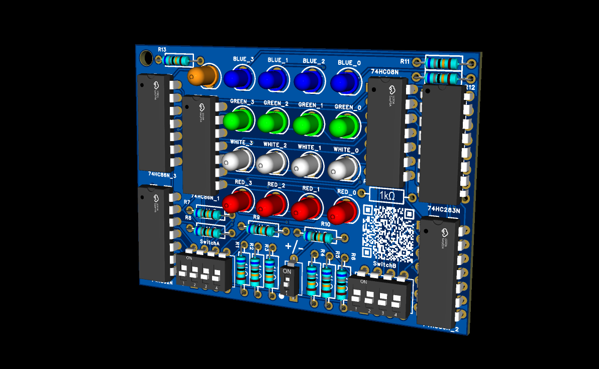

# 4-Bit Discrete Logic ALU (Arithmetic Logic Unit)

A hardware-level implementation of a **4-bit Arithmetic Logic Unit (ALU)** designed entirely using discrete **74HCxx series logic ICs**.

This project performs arithmetic and bitwise logic operations without using microcontrollers, FPGAs, or all-in-one ALU ICs such as the 74HC283.

---

## 📸 Circuit Schematic & Simulation



**Figure 1.** Full 4-bit ALU schematic simulated in Proteus.

The design consists of independent arithmetic and logic units operating in parallel on the same 4-bit input operands.

---

## 🚀 Key Features

### Concurrent Parallel Computation

The arithmetic and bitwise logic blocks process the shared 4-bit input vectors `A[3:0]` and `B[3:0]` simultaneously.

### Arithmetic Operations

- Addition:  
  `A + B`

- Subtraction using two's complement:  
  `A - B = A + (~B) + 1`

### Bitwise Logic Operations

- `A AND B`
- `A OR B`
- `A XOR B`

### Carry / Borrow Flag Conditioning

To obtain a unified output flag, the design uses an XOR gate:

```text
Cout = C4 XOR SUB
````

Therefore:

| Operation              | SUB | Cout = 1  |
| ---------------------- | --- | --------- |
| Addition               | 0   | Carry-out |
| Subtraction            | 1   | Borrow    |
| Subtraction with A = B | 1   | 0         |

For subtraction, the output represents a negative result when a borrow occurs.

---

# 🧩 Bill of Materials (BOM)

| Component                 | Part Number       | Quantity | Description                                            |
| ------------------------- | ----------------- | -------- | ------------------------------------------------------ |
| 4-Bit Binary Adder        | 74HC283 / 74LS283 | 1        | 4-bit full adder                                       |
| Quad 2-Input XOR          | 74HC86            | 2        | Controlled inversion, XOR logic, and flag conditioning |
| Quad 2-Input AND          | 74HC08            | 1        | Bitwise AND                                            |
| Quad 2-Input OR           | 74HC32            | 1        | Bitwise OR                                             |
| 4-Position DIP Switch     | SPST              | 2        | Inputs for `A[3:0]` and `B[3:0]`                       |
| SPST Switch               | —                 | 1        | `SUB` control input                                    |
| Current-Limiting Resistor | 330 Ω, 0.25 W     | 17       | LED protection                                         |
| Pull-Down Resistor        | 10 kΩ, 0.25 W     | 9        | DIP switch input pull-down                             |
| Decoupling Capacitor      | 100 nF            | 5        | One capacitor per IC                                   |
| LED Indicator             | 5 mm              | 17       | 16 output indicators + 1 `Cout` indicator              |
| Breadboard                | —                 | 1+       | Hardware implementation                                |
| Regulated DC Supply       | 5 V               | 1        | Logic power supply                                     |

---

# 📐 Pin Connections & Wiring Guide

## 1. Power Rails

The 74HC series requires a stable supply voltage.

### 14-Pin ICs

For:

* 74HC08
* 74HC32
* 74HC86

Connect:

```text
Pin 14 → +5 V
Pin 7  → GND
```

### 16-Pin IC

For the 74HC283:

```text
Pin 16 → +5 V
Pin 8  → GND
```

Place a **100 nF ceramic capacitor** between VCC and GND near each IC.

```text
VCC ─────┐
         │
       100 nF
         │
GND ─────┘
```

This helps reduce supply noise caused by switching transients.

---

# 2. Controlled Inverter & Arithmetic Unit

## IC1 — 74HC86

The first 74HC86 is used as a controlled inverter.

The operation is:

```text
B_inv = B XOR SUB
```

Therefore:

```text
SUB = 0 → B_inv = B
SUB = 1 → B_inv = NOT B
```

### Bit Connections

| Bit | Input B | SUB    | Output |
| --- | ------- | ------ | ------ |
| B0  | Pin 1   | Pin 2  | Pin 3  |
| B1  | Pin 4   | Pin 5  | Pin 6  |
| B2  | Pin 9   | Pin 10 | Pin 8  |
| B3  | Pin 12  | Pin 13 | Pin 11 |

So:

```text
B_inv0 → Pin 3
B_inv1 → Pin 6
B_inv2 → Pin 8
B_inv3 → Pin 11
```

---

# 3. 74HC283 4-Bit Binary Adder

The 74HC283 performs:

```text
A + B_inv + SUB
```

This gives:

```text
SUB = 0:

A + B
```

and:

```text
SUB = 1:

A + NOT(B) + 1
= A - B
```

## Operand A Connections

| Operand | 74HC283 Pin |
| ------- | ----------- |
| A0      | Pin 5       |
| A1      | Pin 3       |
| A2      | Pin 14      |
| A3      | Pin 12      |

## Operand B Connections

| Operand | 74HC283 Pin | Source        |
| ------- | ----------- | ------------- |
| B_inv0  | Pin 6       | 74HC86 Pin 3  |
| B_inv1  | Pin 2       | 74HC86 Pin 6  |
| B_inv2  | Pin 15      | 74HC86 Pin 8  |
| B_inv3  | Pin 11      | 74HC86 Pin 11 |

## Carry-In

```text
74HC283 Pin 7 (C0) → SUB
```

This is what adds the required `+1` during two's-complement subtraction.

## Arithmetic Outputs

| Output | 74HC283 Pin |
| ------ | ----------- |
| Σ0     | Pin 4       |
| Σ1     | Pin 1       |
| Σ2     | Pin 13      |
| Σ3     | Pin 10      |
| C4     | Pin 9       |

The four sum outputs are connected to the arithmetic result LEDs.

---

# 4. Status Flag Conditioning

The raw carry output from the 74HC283 is:

```text
C4
```

It is passed through an XOR gate together with `SUB`:

```text
Cout = C4 XOR SUB
```

### Connections

```text
74HC283 Pin 9 (C4)
        │
        ▼
74HC86 XOR input
        │
SUB ────┘
        │
        ▼
     Cout LED
```

The conditioned output is connected to the `Cout` LED through a 330 Ω resistor.

```text
74HC86 output
     │
     ▼
 LED Anode (+)
 LED Cathode (-)
     │
   330 Ω
     │
    GND
```

---

# 5. Bitwise AND Unit — 74HC08

The 74HC08 performs four independent bitwise AND operations.

| Bit | Inputs | Output |
| --- | ------ | ------ |
| 0   | A0, B0 | AND0   |
| 1   | A1, B1 | AND1   |
| 2   | A2, B2 | AND2   |
| 3   | A3, B3 | AND3   |

Pin connections:

```text
Gate 1:
Pin 1 → A0
Pin 2 → B0
Pin 3 → AND0

Gate 2:
Pin 4 → A1
Pin 5 → B1
Pin 6 → AND1

Gate 3:
Pin 9  → A2
Pin 10 → B2
Pin 8  → AND2

Gate 4:
Pin 12 → A3
Pin 13 → B3
Pin 11 → AND3
```

---

# 6. Bitwise OR Unit — 74HC32

The 74HC32 performs four independent bitwise OR operations.

| Bit | Inputs | Output |
| --- | ------ | ------ |
| 0   | A0, B0 | OR0    |
| 1   | A1, B1 | OR1    |
| 2   | A2, B2 | OR2    |
| 3   | A3, B3 | OR3    |

Pin connections:

```text
Gate 1:
Pin 1 → A0
Pin 2 → B0
Pin 3 → OR0

Gate 2:
Pin 4 → A1
Pin 5 → B1
Pin 6 → OR1

Gate 3:
Pin 9  → A2
Pin 10 → B2
Pin 8  → OR2

Gate 4:
Pin 12 → A3
Pin 13 → B3
Pin 11 → OR3
```

---

# 7. Bitwise XOR Unit — 74HC86

The second 74HC86 performs four independent XOR operations.

```text
XOR0 = A0 XOR B0
XOR1 = A1 XOR B1
XOR2 = A2 XOR B2
XOR3 = A3 XOR B3
```

Example pin assignment:

```text
Gate 1:
Pin 1 → A0
Pin 2 → B0
Pin 3 → XOR0

Gate 2:
Pin 4 → A1
Pin 5 → B1
Pin 6 → XOR1

Gate 3:
Pin 9  → A2
Pin 10 → B2
Pin 8  → XOR2

Gate 4:
Pin 12 → A3
Pin 13 → B3
Pin 11 → XOR3
```

---

# 📊 Truth Table & Verification

The following vectors can be used to verify the ALU in Proteus or on the physical breadboard.

| Operation            | SUB | A           | B          | Expected Result | Cout |
| -------------------- | --- | ----------- | ---------- | --------------- | ---- |
| Addition             | 0   | `0101` (5)  | `0011` (3) | `1000` (8)      | 0    |
| Addition with Carry  | 0   | `1111` (15) | `0001` (1) | `0000`          | 1    |
| Equal Subtraction    | 1   | `0001` (1)  | `0001` (1) | `0000`          | 0    |
| Negative Subtraction | 1   | `0010` (2)  | `0101` (5) | `1101` (-3)     | 1    |
| Bitwise AND          | X   | `1100`      | `1010`     | `1000`          | —    |
| Bitwise OR           | X   | `1100`      | `1010`     | `1110`          | —    |
| Bitwise XOR          | X   | `1100`      | `1010`     | `0110`          | —    |

### Example: Addition

```text
A = 0101
B = 0011

0101 + 0011 = 1000

5 + 3 = 8
```

### Example: Subtraction

```text
A = 0010
B = 0101

0010 - 0101 = -3

Two's complement representation:

-3 = 1101
```

Because the subtraction requires a borrow:

```text
Cout = 1
```

---

# 💡 LED Connection

For active-high LED indicators:

```text
IC Output
    │
    ▼
LED Anode (+)
LED Cathode (-)
    │
   10 Ω
    │
    ▼
   GND
```

The 10 Ω resistor limits LED current and protects both the LED and logic output.

---

# 🧠 Design Architecture

The ALU is organized into independent functional blocks:

```text
                 ┌─────────────────────┐
A[3:0] ─────────►│                     │
                 │   Arithmetic Unit   │──────► Arithmetic Result
B[3:0] ─────────►│     74HC283         │
        ┌───────►│                     │
        │        └─────────────────────┘
        │
        │
        │        ┌─────────────────────┐
        ├───────►│      AND Unit       │──────► AND Result
        │        │      74HC08         │
        │        └─────────────────────┘
        │
        │        ┌─────────────────────┐
        ├───────►│       OR Unit       │──────► OR Result
        │        │      74HC32         │
        │        └─────────────────────┘
        │
        │        ┌─────────────────────┐
        └───────►│      XOR Unit       │──────► XOR Result
                 │      74HC86         │
                 └─────────────────────┘
```

The arithmetic and logic blocks operate concurrently. A future revision can add an output multiplexer and operation-selection logic to create a single 4-bit ALU output bus.

---

# 📌 Project Highlights

This project demonstrates practical understanding of:

* Combinational digital logic
* Full-adder architecture
* Two's-complement arithmetic
* Carry and borrow behavior
* XOR-controlled inversion
* Bitwise logic operations
* 74HC-series logic ICs
* CMOS input handling
* LED output interfacing
* Breadboard-level hardware design
* Proteus circuit simulation
* Hardware debugging and verification

The project is intentionally implemented from fundamental logic building blocks rather than using an integrated ALU IC.

---
Nguyen Van Khoa
